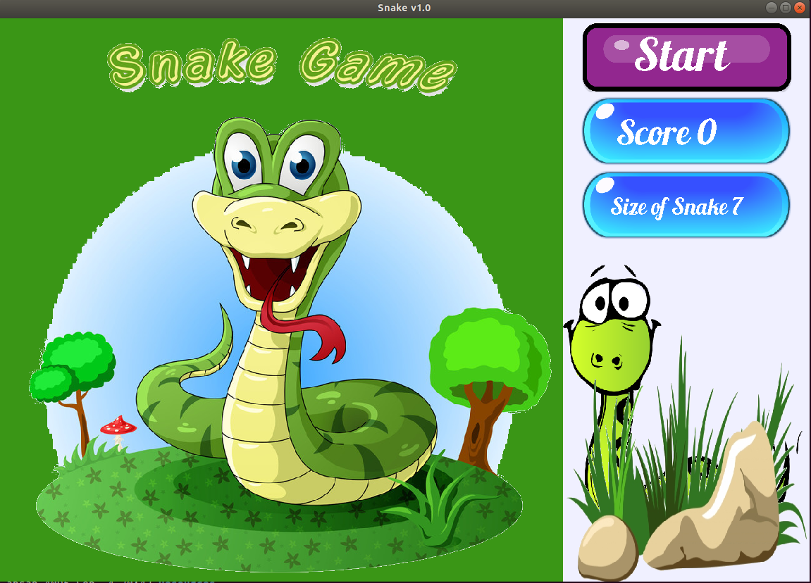
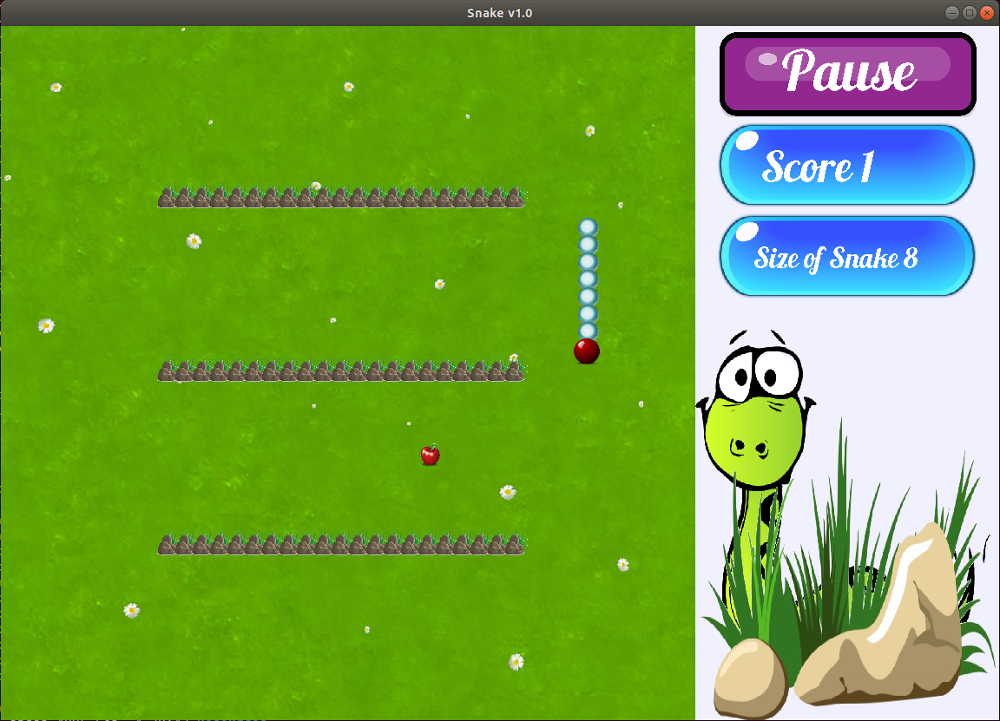
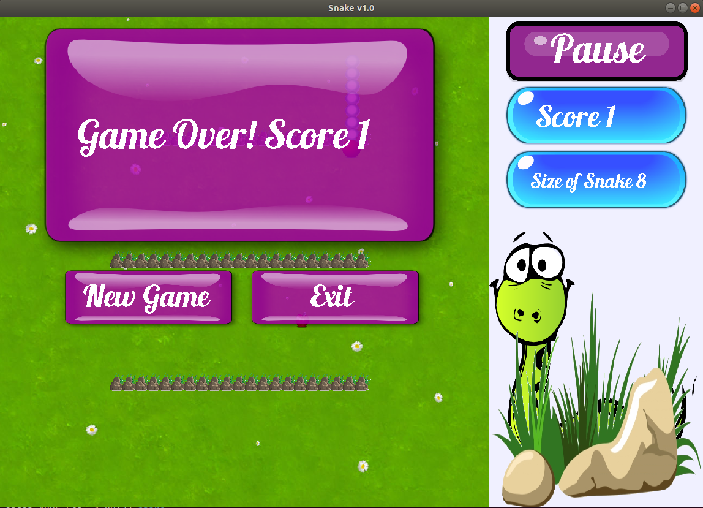

Snake
===============

***Author: D M Raisul Ahsan***  
***Date: 5/5/2019***

Game play
----------

The snake starts with an initial length. Move the snake using keyboard button UP(go up), DOWN(go down), RIGHT(go right), LEFT(go left).
The target is to move the snake and eat food. Eating food everytime increases the score by 1.
The snake dies if it hits itself or hit the walls. The snake can move through from one end and come back from another end if there is no
wall. 
There are four levels of the game. After every 20 score you reach the next level. 
- - - 
Classes used in the game are
-----------------------------

* *Snake*
* *Wall*
* *Dimensions*
* *GenRandomFoodPosition*
* *GenRandomSnakePosition*
* *Food*
* *GameManager*
* *Life*
* *SideBar*
* *CustomButton*
* *PaintBoard*
* *SnakeGui*
- - -
Most of the classes are explained by the comments.
In short, Snake is a linkedlist of coordinates. Moving snake add one coordinate at the head and removes one from the end.
Wall and Dimensions gives the linkedlists of board size and wall coordinates.
All the processes are gathered in GameManager. After every snake move the evaluation is done if the head of the snake has same coordinate
as the any of the wall or snake body coordinates which is found yes means death and game over.
Same process goes on with the food coordinate to check if food is eaten and score is increased.
Life is a class that makes something like food which, if eaten, doesn't increase the score, but decrease snake size.
- - -

*You have to have JDK installed in your computer to play the game.*  
*Commands to play: Go to the parent folder/directory where snake and Resources folder lies*  
*Use the command javac snake/src/SnakeGui.java*  
*The use the command java snake.src.SnakeGui*

- - -

